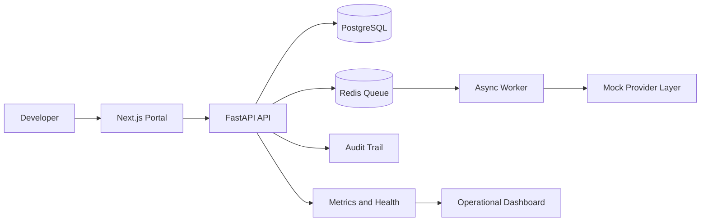

# Arquitetura

## Fluxo
1. O usuário entra no portal e escolhe um serviço.
2. A API valida permissões, grava auditoria e cria o deploy.
3. O worker consome a fila e simula provisionamento.
4. O dashboard mostra estado, métricas e histórico.
